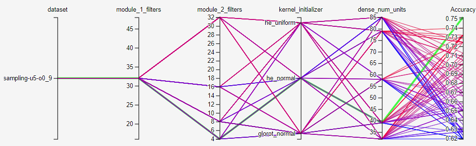
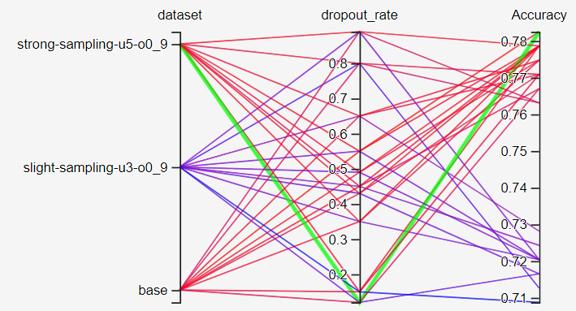
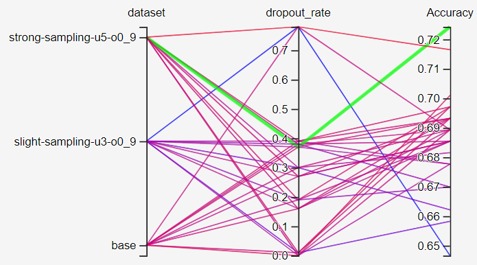
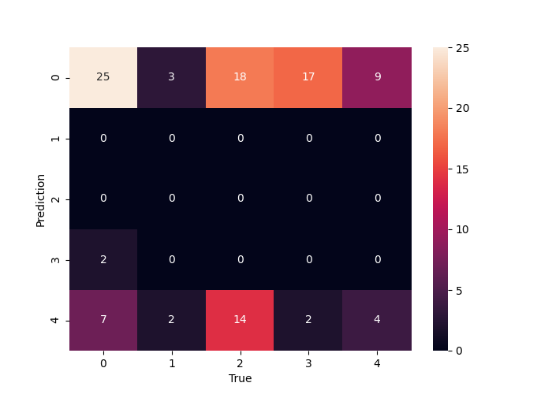
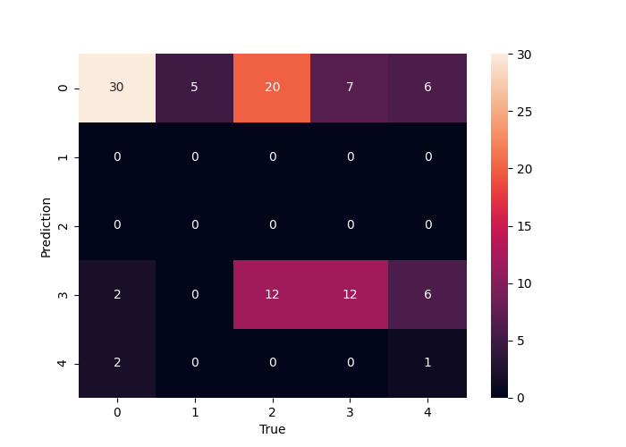
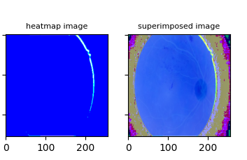
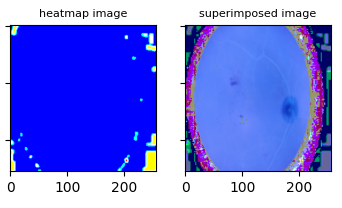

# DiabeticRetinopathy

# Info
This is the main branch

# How to run the code

Configure the config.gin file in /config:

1. Setup the dataset under 'Input pipeline'/'DatasetLoader':
    - 'dataset_name': Shall be 'idrid
    - 'dataset_directory': The absolute path to a directory containing the dataset files.
    - 'tfrecords_directory': The absolute path to a directory which is the destination of the created dataset tfrecord files. Also is where the dataset files are loaded from in the future.
    - 'dataset_specifications': Datasets are created from the parameters in this list of dict. The parameters are a name to identify the dataset and the two sampling parameters 'undersample_ratio' and 'oversample_ratio'. To create a 'base', unsampled, dataset set the two ratios to zero.
    - 'tfrecords_operation': This dis-/enables the dataset creation, 'create' leads to the creation of all the datasets in 'dataset_specifications', 'read' skips the creation.
    - The rest of the parameters are self explanatory.

2. Setup the training under 'Train':
    There exists a basic, fine-tune and early-stopping section.

3. Setup the models under 'Main':
    Create models in 'models', examples and descriptions explain how. Here the created datasets are referenced.

Start by running: `python3 main.py` in the directory. Available flags are '--train'/'--notrain', '--eval'/'--noeval' and '--ensem'/'--noensem'. These flags select training, evaluation ensemble learning, the defaults are True/True/False.

# Results

This section captures some results for the project 'Diabetic Retinopathy' 

## Hyparameter Evalutaion
Some of the results for Hyperparameter tuning are as follows - 

### Inception_like
| Dataset                  | Module 1 filters | Module 2 filters | Kernel Initializer | Dense Units | Dropout Rate | Accuracy |
| :----:                   |    :----:        |  :----:          |    :----:          |   :----:    | :----:       | :----:   |  
| strong-sampling-u5-o0_9  |      32          |        4         |       he_normal    |     39      |      0.7     |  75.15%  |

### Resnet50
| Dataset                  |  Dropout Rate | Accuracy |
| :----:                   | :----:        | :----:   |  
| strong-sampling-u5-o0_9  |      0.12     |  78.26%  |

### InceptionV3
| Dataset                  |  Dropout Rate | Accuracy |
| :----:                   | :----:        | :----:   |  
| strong-sampling-u5-o0_9  |      0.37     |  72.43%  |

\
\
The Confusion Matrix for **Inception_like** and **Resnet50** model with best hyperparameter settings - 

 

    

  
## Ensemble Learning

Ensemble learning were done on base models - 
1. **Inception_like** - with Module 1 and Module 2 filters of 32 and 4 units respectively, 
   Dense layer of 40 units and Dropout rate of 0.7
    
2. **Resnet50** - Fine tuning from 150 layer onwards

3. **InceptionV3** - Fine tuning from 249 layer onwards

|         | Inception_like  |  Resnet50 | Inceptionv3 | **Ensemble** |
| :----:  | :----:          | :----:    |    :----:   |  :----:  |
| Accuracy| 71.3%           |     73.1% |    67.4%    | **75.9%**    |

## Visualization

We performed GRADCAM on the test dataset to get the confidence of the model performance. 
All the GRADCAM images are plotted on the Tensorboard for the test dataset. 
Some of the GRADCAM for the model **Inception_like** are shown below

\
For output label 0 \
 

For output label 4 \

